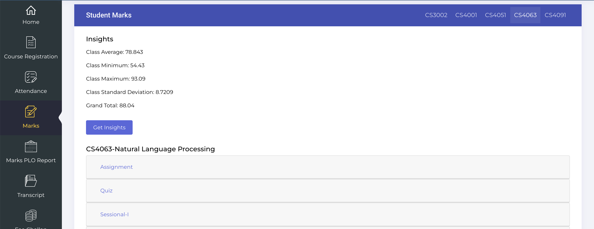

# Status: Patched. No longer works.
The workaround has been patched by FlexStudent by implementing Cross-Origin Policy on their website. The extension shall no longer work. Thank you for your  continued support throughout the time.

## Flex Student Portal Insights
This is a Chrome extension that allows you to view hidden insights in your course page easily. This was developed with a quick solution in mind and gets the job done in the simplest way possible. Contributions and features welcome.

## Installation Procedure
Follow this installation procedure to get started with the extension. The installation is dependency free and only requires Chrome.

- Clone this repository.

- Unzip the folder.

- Visit ```chrome://extensions/```.

- Enable developer mode.

- Click on ```Load unpacked``` and select the unzipped folder.

## Installation Video

[](https://youtu.be/ZtzXTtzA8EM)

## Usage
- Visit your Marks page on FlexStudent Portal.

- You will start to see a "Get Insights" button on top of your course title.

- Click on the button to view the hidden insights.



## Disclaimer
This code is provided for educational purposes only. The code is not intended to be used for malicious purposes or to gain unauthorized access to any system. The author of this code takes no responsibility for any misuse of the code. Use at your own risk.
